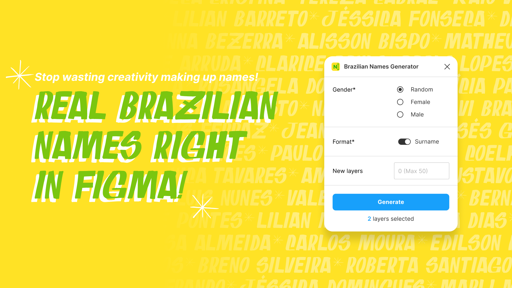

# Brazilian Names Generator – Figma Plugin

A simple and minimalist plugin to generate real Brazilian names and surnames directly in Figma. [Use it now!](https://www.figma.com/@pedropalmier/) 

## About
Create or fill text layers with the most common names sourced from [Brazil's latest official 2022 Census](https://censo2022.ibge.gov.br/nomes).

## Features
- Top 600 names: 200 female, 200 male, 200 surnames
- Fill selected text layers or create up to 50 new ones
- Filter by gender
- Toggle surname

## Tech Stack
- HTML / CSS / JavaScript / TypeScript
- Cursor, Claude Code, Figma
- [Figma Plugin DS](https://github.com/thomas-lowry/figma-plugin-ds) (Design system)
